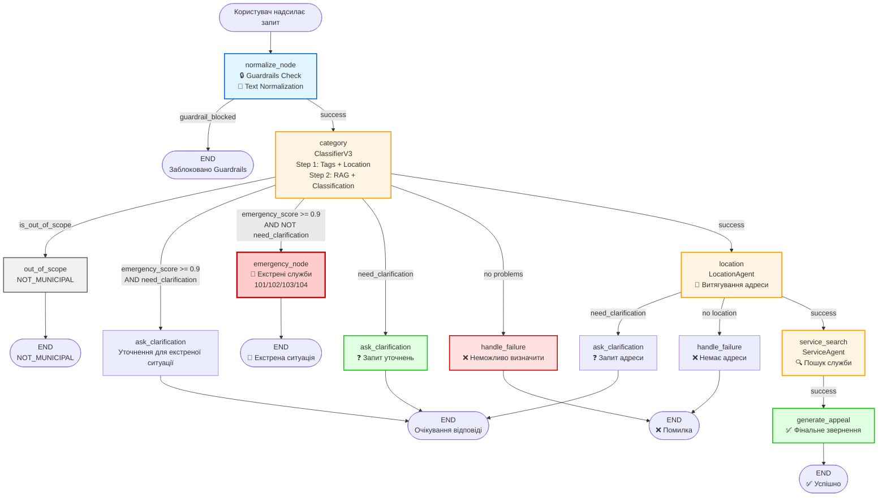

# Архітектура CityServiceAI Orchestrator

## 📋 Зміст

1. [Загальний огляд](#загальний-огляд)
2. [Архітектура системи](#архітектура-системи)
3. [LangGraph User Flow](#langgraph-user-flow)
4. [Опис категорій](#опис-категорій)
5. [Детальний опис компонентів](#детальний-опис-компонентів)
6. [Технологічний стек](#технологічний-стек)
7. [Потік даних](#потік-даних)

---

## Загальний огляд

**CityServiceAI Orchestrator** — це інтелектуальна система обробки звернень громадян до міських комунальних служб. Система використовує **LangGraph** для оркестрації multi-agent workflow, **LLM** для розуміння та класифікації проблем, **RAG** для пошуку релевантних категорій, та **AWS Bedrock Guardrails** для забезпечення безпеки контенту.

### Основні можливості:

- ✅ Автоматична класифікація комунальних проблем за ієрархічною структурою категорій
- ✅ Витягування структурованої адреси з неструктурованого тексту
- ✅ Визначення відповідальної служби для вирішення проблеми
- ✅ Обробка екстрених ситуацій (пожежа, газ, медична допомога)
- ✅ Перевірка безпеки контенту через AWS Bedrock Guardrails
- ✅ Повний трейсинг та моніторинг через Langfuse
- ✅ Інтелектуальні уточнюючі запитання при недостатності інформації

---

## Архітектура системи

### Високорівнева архітектура

```
┌─────────────────────────────────────────────────────────────────┐
│                         FastAPI Application                      │
│  ┌──────────────────────────────────────────────────────────┐   │
│  │              /conversation endpoint                      │   │
│  │  ┌──────────────────────────────────────────────────┐   │   │
│  │  │         LangGraph State Machine                    │   │   │
│  │  │  ┌──────────┐  ┌──────────┐  ┌──────────┐       │   │   │
│  │  │  │ normalize│→ │ category │→ │ location │→ ...   │   │   │
│  │  │  └──────────┘  └──────────┘  └──────────┘       │   │   │
│  │  └──────────────────────────────────────────────────┘   │   │   │
│  └──────────────────────────────────────────────────────────┘   │
│                                                                   │
│  ┌──────────────────────────────────────────────────────────┐   │
│  │                    Services Layer                         │   │
│  │  • Guardrails Service (AWS Bedrock)                      │   │
│  │  • Langfuse Service (Observability)                      │   │
│  └──────────────────────────────────────────────────────────┘   │
│                                                                   │
│  ┌──────────────────────────────────────────────────────────┐   │
│  │                    Agents Layer                            │   │
│  │  • ClassifierV3 (GPT-4.1-mini + GPT-4.1)                 │   │
│  │  • LocationAgent (GPT-4.1-mini)                          │   │
│  │  • ServiceAgent                                           │   │
│  └──────────────────────────────────────────────────────────┘   │
│                                                                   │
│  ┌──────────────────────────────────────────────────────────┐   │
│  │                    Data Layer                              │   │
│  │  • FAISS Vector Database (RAG для категорій)             │   │
│  │  • CSV Categories Data                                    │   │
│  └──────────────────────────────────────────────────────────┘   │
└─────────────────────────────────────────────────────────────────┘
```

### Компоненти системи

1. **API Layer (FastAPI)**
   - REST API endpoint для обробки звернень
   - Валідація вхідних даних через Pydantic
   - Інтеграція з LangGraph

2. **Orchestration Layer (LangGraph)**
   - State machine для управління workflow
   - Conditional routing між нодами
   - State management (ConversationGraphState)

3. **Agent Layer**
   - **ClassifierV3**: Двоетапна класифікація проблем
   - **LocationAgent**: Витягування адреси
   - **ServiceAgent**: Пошук відповідальної служби

4. **Service Layer**
   - **Guardrails Service**: Перевірка безпеки контенту
   - **Langfuse Service**: Трейсинг та моніторинг

5. **Data Layer**
   - **FAISS**: Векторна база даних для RAG
   - **CSV Files**: Категорії та метадані

---

## LangGraph User Flow

### Детальна діаграма потоку



### Покроковий опис потоку

#### 1. **normalize_node** (Вхідна точка)

**Вхід**: Повідомлення користувача

**Процес**:
1. **Guardrails Check**:
   - Перевірка через AWS Bedrock Guardrails
   - Блокування образливого/небезпечного контенту
   - Виявлення порушень: WORD_FILTER, CONTENT_FILTER, TOPIC, SENSITIVE_INFORMATION

2. **Text Normalization**:
   - Видалення зайвих пробілів
   - Виправлення помилок
   - Стандартизація тексту

**Вихід**:
- `message`: Нормалізований текст
- `issue_text`: Накопичений текст проблеми
- `guardrail_blocked`: Статус блокування (якщо заблоковано)

**Routing**:
- `guardrail_blocked = true` → **END**
- Інакше → **category**

---

#### 2. **category** / **classifier_node_3** (Класифікація)

**Агент**: `ClassifierV3`

**Процес**:

**Крок 1: Витягування контексту** (GPT-4.1-mini)
- Витягування тегів з опису проблеми
- Визначення типу локації (Квартира, Під'їзд, Двір, Вулиця, тощо)
- Оцінка екстреності (`emergency_score`: 0.0 - 1.0)
- Визначення потреби уточнень (`need_clarification`)
- Створення нормалізованого summary

**Крок 2: RAG + Класифікація** (GPT-4.1)
- Пошук релевантних категорій через **FAISS** на основі тегів
- Семантичний пошук схожих проблем у базі категорій
- Фінальна класифікація за категоріями L3
- Генерація списку проблем з кодами та описом

**Вихід**:
- `category`: Код категорії L3 (наприклад, "U.2.1")
- `category_confidence`: Впевненість (0.0 - 1.0)
- `emergency_score`: Рівень екстреності (0.0 - 1.0)
- `need_clarification`: Чи потрібні уточнення
- `clarification_question`: Уточнююче запитання (якщо потрібно)
- `problems[]`: Список виявлених проблем
- `is_out_of_scope`: Чи проблема не стосується комунальних служб
- `summary`: Нормалізований опис проблеми

**Routing**:
- `is_out_of_scope = true` → **out_of_scope**
- `emergency_score >= 0.9` AND `need_clarification` → **ask_clarification**
- `emergency_score >= 0.9` AND NOT `need_clarification` → **emergency**
- `need_clarification = true` → **ask_clarification**
- `problems.length < 1` → **handle_failure**
- Інакше → **location**

---

#### 3. **location** (Визначення локації)

**Агент**: `LocationAgent` (GPT-4.1-mini)

**Процес**:
- Витягування структурованої адреси з тексту:
  - `city`: Місто
  - `street`: Вулиця
  - `building_number`: Номер будинку
  - `apartment`: Квартира
- Оновлення `summary.context_notes` з адресою
- Визначення достатності інформації про адресу

**Вихід**:
- `location_details`: Структурована адреса
- `confidence`: Впевненість у точності адреси (0.0 - 1.0)
- `need_clarification`: Чи потрібні уточнення адреси
- `clarification_question`: Запитання для уточнення адреси

**Routing**:
- `need_clarification = true` → **ask_clarification**
- Немає локації → **handle_failure**
- Інакше → **service_search**

---

#### 4. **service_search** (Пошук служби)

**Агент**: `ServiceAgent`

**Процес**:
- Пошук відповідальної служби на основі коду категорії
- Витягування контактних даних:
  - Назва служби
  - Телефон
  - Екстрений телефон
  - Email (якщо є)

**Вихід**:
- `problems[].contact_info`: Контактна інформація для кожної проблеми

**Routing**:
- Завжди → **generate_appeal**

---

#### 5. **generate_appeal** (Генерація звернення)

**Процес**:
- Формування фінального повідомлення користувачу
- Включення всієї інформації:
  - Категорія проблеми
  - Адреса
  - Відповідальна служба
  - Контактні дані

**Вихід**:
- `messages[]`: Фінальне повідомлення користувачу

**Routing**:
- Завжди → **END**

---

#### 6. **ask_clarification** (Запит уточнень)

**Процес**:
- Генерація уточнюючого запитання користувачу
- Завершення поточної ітерації графа
- Очікування відповіді користувача

**Вихід**:
- `messages[]`: Повідомлення з уточнюючим запитанням

**Routing**:
- Завжди → **END** (очікування наступного запиту)

---

#### 7. **emergency** (Екстрені служби)

**Процес**:
- Визначення типу екстреної ситуації
- Надання інформації про відповідні екстрені служби:
  - **101**: МНС / Пожежна
  - **102**: Поліція
  - **103**: Швидка допомога
  - **104**: Аварійна газова служба

**Вихід**:
- `messages[]`: Повідомлення з інформацією про екстрені служби

**Routing**:
- Завжди → **END**

---

#### 8. **handle_failure** (Обробка помилок)

**Процес**:
- Генерація загального повідомлення про неможливість визначити службу
- Надання контактів загального диспетчерського центру

**Вихід**:
- `messages[]`: Повідомлення з контактами (1551, https://1551.gov.ua)

**Routing**:
- Завжди → **END**

---

#### 9. **out_of_scope** (Не комунальна проблема)

**Процес**:
- Обробка звернень, які не стосуються комунальних служб
- Надання інформації про те, що проблема не належить до сфери відповідальності

**Вихід**:
- `messages[]`: Повідомлення про те, що проблема не комунальна

**Routing**:
- Завжди → **END**

---

## Опис категорій

Система використовує ієрархічну структуру категорій для класифікації комунальних проблем:

| L1 Код | L1 Назва                       | L2 Код | L2 Назва                        | L3 Код | L3 Назва (проблема)                                       | Відповідальна служба            |
| ------ | ------------------------------ | ------ | ------------------------------- | ------ | --------------------------------------------------------- | ------------------------------- |
| H      | Будинок                        | H.1    | Загальний стан                  | H.1.1  | Не працює ліфт / застряг ліфт                             | ManagementCompany/OSBB          |
| H      | Будинок                        | H.1    | Загальний стан                  | H.1.2  | Протікає дах                                              | ManagementCompany/OSBB          |
| H      | Будинок                        | H.1    | Загальний стан                  | H.1.3  | Поганий стан підвалу (затоплення, сморід)                 | ManagementCompany/OSBB          |
| H      | Будинок                        | H.2    | Під'їзд                         | H.2.1  | Не горить світло у під'їзді                               | ManagementCompany/OSBB          |
| H      | Будинок                        | H.2    | Під'їзд                         | H.2.2  | Не прибирають у під'їзді                                  | ManagementCompany/OSBB          |
| H      | Будинок                        | H.2    | Під'їзд                         | H.2.3  | Пошкоджені двері / вікна в під'їзді                       | ManagementCompany/OSBB          |
| D      | Двір                           | D.1    | Благоустрій                     | D.1.1  | Яма на внутрішньодворовому проїзді                        | ManagementCompany/OSBB          |
| D      | Двір                           | D.1    | Благоустрій                     | D.1.2  | Відсутнє освітлення двору                                 | ManagementCompany/OSBB          |
| D      | Двір                           | D.1    | Благоустрій                     | D.1.3  | Пошкоджений дитячий/спортивний майданчик                  | ManagementCompany/OSBB          |
| D      | Двір                           | D.2    | Санітарія                       | D.2.1  | Не вивозять сміття (контейнери)                           | MunicipalUtility_WasteCollector |
| U      | Комунальні послуги             | U.1    | Електроенергія                  | U.1.1  | Немає світла у квартирі / будинку                         | MunicipalUtility_Electricity    |
| U      | Комунальні послуги             | U.1    | Електроенергія                  | U.1.2  | Перепади напруги                                          | MunicipalUtility_Electricity    |
| U      | Комунальні послуги             | U.2    | Водопостачання (холодна вода)   | U.2.1  | Немає холодної води                                       | MunicipalUtility_Water          |
| U      | Комунальні послуги             | U.2    | Водопостачання (холодна вода)   | U.2.2  | Слабкий напір холодної води                               | MunicipalUtility_Water          |
| U      | Комунальні послуги             | U.3    | Гаряча вода                     | U.3.1  | Немає гарячої води                                        | MunicipalUtility_HeatProvider   |
| U      | Комунальні послуги             | U.3    | Гаряча вода                     | U.3.2  | Ледь тепла вода (низька температура)                      | MunicipalUtility_HeatProvider   |
| U      | Комунальні послуги             | U.4    | Опалення                        | U.4.1  | Холодні батареї в опалювальний сезон                      | MunicipalUtility_HeatProvider   |
| U      | Комунальні послуги             | U.4    | Опалення                        | U.4.2  | Прорив труби опалення (в квартирі/під'їзді)               | ManagementCompany/OSBB          |
| U      | Комунальні послуги             | U.5    | Каналізація                     | U.5.1  | Забита каналізація у квартирі / стояку                    | ManagementCompany/OSBB          |
| U      | Комунальні послуги             | U.5    | Каналізація                     | U.5.2  | Фекальні стоки у підвалі                                  | ManagementCompany/OSBB          |
| U      | Комунальні послуги             | U.6    | Ливнева каналізація             | U.6.1  | Стоїть вода після дощу                                    | MunicipalUtility_Water          |
| U      | Комунальні послуги             | U.6    | Ливнева каналізація             | U.6.2  | Забита ливнівка                                           | MunicipalUtility_Water          |
| R      | Вулиці / місто                 | R.1    | Дороги                          | R.1.1  | Яма на проїжджій частині                                  | MunicipalUtility_Roads          |
| R      | Вулиці / місто                 | R.2    | Освітлення                      | R.2.1  | Не горить вуличний ліхтар                                 | MunicipalUtility_Electricity    |
| R      | Вулиці / місто                 | R.3    | Благоустрій                     | R.3.1  | Нелегальне звалище / сміття на вулиці                     | MunicipalUtility_WasteCollector |
| E      | Екстрені служби                | E.1    | МНС / пожежна                   | E.1.1  | Пожежа / сильне задимлення / загроза вибуху               | МНС (101)                       |
| E      | Екстрені служби                | E.2    | Поліція                         | E.2.1  | Правопорушення / небезпека для людей                      | Поліція (102)                   |
| E      | Екстрені служби                | E.3    | Швидка допомога                 | E.3.1  | Невідкладний стан здоров'я                                | Швидка (103)                    |
| E      | Екстрені служби                | E.4    | Аварійна газова служба          | E.4.1  | Запах газу / підозра на витік газу                        | Газова служба (104)             |
| X      | Диспетчер / уточнення          | X.1    | Невизначена комунальна проблема | X.1.1  | Потрібне уточнення диспетчера (UNCLEAR)                   | Диспетчер                       |
| Z      | Не наша сфера відповідальності | Z.1    | Не комунальна проблема          | Z.1.1  | Проблема не належить до комунальних служб (NOT_MUNICIPAL) | -                               |

**Повний список категорій доступний у файлі:** `app/data/categories.csv` та `app/data/categories_2.csv`

---

## Детальний опис компонентів

### Ноди (Nodes)

#### 1. **normalize_node**
- **Призначення**: Нормалізація тексту та перевірка безпеки
- **Технології**: AWS Bedrock Guardrails, Text Normalizer
- **Вхід**: Повідомлення користувача
- **Вихід**: Нормалізований текст, статус безпеки
- **Особливості**: Fail-close при блокуванні Guardrails

#### 2. **category** / **classifier_node_3**
- **Агент**: `ClassifierV3`
- **Призначення**: Двоетапна класифікація проблем
- **Технології**: GPT-4.1-mini, GPT-4.1, FAISS RAG
- **Процес**:
  1. Крок 1: Витягування тегів, локації, екстреності
  2. Крок 2: RAG пошук + фінальна класифікація
- **Вихід**: Категорія, confidence, emergency_score, problems[]

#### 3. **location**
- **Агент**: `LocationAgent`
- **Призначення**: Витягування структурованої адреси
- **Технології**: GPT-4.1-mini
- **Вихід**: location_details (city, street, building_number, apartment)

#### 4. **service_search**
- **Агент**: `ServiceAgent`
- **Призначення**: Пошук відповідальної служби
- **Вихід**: Контактна інформація служби

#### 5. **ask_clarification**
- **Призначення**: Генерація уточнюючого запитання
- **Вихід**: Повідомлення з запитанням

#### 6. **emergency**
- **Призначення**: Обробка екстрених ситуацій
- **Вихід**: Інформація про екстрені служби (101/102/103/104)

#### 7. **handle_failure**
- **Призначення**: Обробка помилок
- **Вихід**: Контакти диспетчерського центру (1551)

#### 8. **generate_appeal**
- **Призначення**: Генерація фінального звернення
- **Вихід**: Повне повідомлення користувачу

#### 9. **out_of_scope**
- **Призначення**: Обробка некомунальних проблем
- **Вихід**: Повідомлення про NOT_MUNICIPAL

### Агенти (Agents)

#### **ClassifierV3**
- **Моделі**: GPT-4.1-mini (Step 1), GPT-4.1 (Step 2)
- **RAG**: FAISS для семантичного пошуку категорій
- **Особливості**: Двоетапна класифікація з контекстом

#### **LocationAgent**
- **Модель**: GPT-4.1-mini
- **Особливості**: Витягування структурованої адреси з неструктурованого тексту

#### **ServiceAgent**
- **Особливості**: Пошук служби на основі коду категорії

---

## Технологічний стек

### Backend Framework

- **FastAPI** (v0.104+)
  - Асинхронний веб-фреймворк для Python
  - REST API endpoints
  - Автоматична генерація документації (OpenAPI/Swagger)
  - Валідація через Pydantic

- **Uvicorn** (standard)
  - ASGI сервер для запуску FastAPI
  - Підтримка WebSockets
  - Автоматичне reload при змінах

### AI/ML & Orchestration

- **LangGraph** (latest)
  - Фреймворк для побудови stateful multi-agent applications
  - State machine для управління workflow
  - Conditional routing між нодами
  - Підтримка циклів та рекурсії

- **LiteLLM** (latest)
  - Уніфікований інтерфейс для роботи з різними LLM провайдерами
  - Підтримка OpenAI, Anthropic, Azure OpenAI, тощо
  - Автоматичне retry та error handling
  - Usage tracking

- **OpenAI API** (через LiteLLM)
  - **GPT-4.1-mini**: Використовується для Step 1 класифікації та LocationAgent
  - **GPT-4.1**: Використовується для Step 2 класифікації (фінальна класифікація)
  - JSON mode для структурованих відповідей
  - Temperature = 0.0 для детерміністичних результатів

### Vector Database & RAG

- **FAISS** (Facebook AI Similarity Search) (faiss-cpu)
  - Векторна база даних для семантичного пошуку
  - Індекс категорій для RAG
  - Швидкий similarity search
  - Підтримка embeddings

- **Pandas** (latest)
  - Обробка даних категорій з CSV
  - Маніпуляції з даними
  - Підготовка даних для FAISS

- **NumPy** (latest)
  - Робота з векторами та embeddings
  - Математичні операції
  - Підтримка FAISS

### Monitoring & Observability

- **Langfuse** (>=2.0.0)
  - Моніторинг та трейсинг LLM викликів
  - Трейсинг всіх нод LangGraph
  - Моніторинг використання токенів та витрат
  - Аналітика та діагностика
  - Інтеграція з LangGraph через CallbackHandler

### Security & Content Moderation

- **AWS Bedrock Guardrails** (через boto3)
  - Перевірка безпеки вхідного контенту
  - Блокування образливого контенту
  - Виявлення порушень:
    - WORD_FILTER: Заборонені слова
    - CONTENT_FILTER: Неприйнятний контент
    - TOPIC: Заборонені теми
    - SENSITIVE_INFORMATION: Чутлива інформація
    - CONTEXTUAL_GROUNDEDNESS: Галюцинації
  - Fail-close стратегія при блокуванні

- **boto3** (>=1.34.0) / **botocore** (>=1.34.0)
  - AWS SDK для Python
  - Підтримка IAM roles для автоматичного оновлення credentials
  - Retry logic та error handling

### Data Processing

- **PyYAML** (latest)
  - Парсинг YAML конфігурацій агентів
  - Зберігання промптів у YAML форматі

- **python-dotenv** (latest)
  - Завантаження змінних оточення з .env файлу
  - Безпечне зберігання секретів

### Data Validation

- **Pydantic** (>=2.5)
  - Валідація даних та схем
  - Type hints для Python
  - Автоматична генерація JSON схем
  - Валідація вхідних/вихідних даних API

### Utilities

- **Logging** (вбудований Python)
  - Структуроване логування всіх операцій
  - Різні рівні логування (DEBUG, INFO, WARNING, ERROR)
  - Форматування логів з контекстом

### Infrastructure

- **Docker** (latest)
  - Контейнеризація додатку
  - Ізоляція залежностей
  - Легке розгортання

- **Docker Compose** (latest)
  - Оркестрація контейнерів
  - Управління сервісами
  - Network та volume management

---

## Потік даних

### Вхідні дані

```json
{
  "id": "conversation_id",
  "messages": [
    {
      "role": "user",
      "content": "У під'їзді тече вода з труби між 2 і 3 поверхом"
    }
  ],
  "summary": {
    "normalized_description": "...",
    "context_notes": "..."
  }
}
```

### Внутрішній стан (ConversationGraphState)

```typescript
{
  messages: Message[]                    // Історія діалогу
  message: string                        // Поточне повідомлення
  issue_text: string                     // Накопичений текст проблеми
  trace: TraceEntry[]                    // Трейсинг інформація
  
  conversation_id: string                // ID розмови
  category: string                       // Код категорії L3
  category_confidence: float             // Впевненість (0.0-1.0)
  need_clarification: boolean            // Чи потрібні уточнення
  clarification_count: int              // Кількість уточнень
  
  problem: ProblemDescriptor             // Поточна проблема
  problems: ProblemDescriptor[]          // Список проблем
  summary: ProblemSummary                // Нормалізований опис
  
  emergency_score: float                 // Рівень екстреності (0.0-1.0)
  guardrail_blocked: boolean            // Статус блокування Guardrails
  
  location_type: string                  // Тип локації
  location_details: LocationDetails      // Структурована адреса
  
  is_out_of_scope: boolean              // Чи не комунальна проблема
}
```

### Вихідні дані

```json
{
  "id": "conversation_id",
  "messages": [
    {
      "role": "assistant",
      "content": "Ваша проблема U.4.2: Прорив труби опалення...",
      "agent": "service"
    }
  ],
  "summary": {
    "normalized_description": "Протікання води з труби у під'їзді...",
    "context_notes": "Адреса: місто Київ, проспект Науки 69"
  },
  "problems": [
    {
      "code": "U.4.2",
      "description": "Прорив труби опалення",
      "category_name": "Управління багатоквартирним будинком",
      "contact_info": {
        "name": "ЖЕК",
        "phone": "044-xxx-xx-xx"
      }
    }
  ],
  "trace": [...]
}
```

---

## Архітектурні принципи

1. **Модульність**: Кожен агент та нода виконують одну конкретну задачу
2. **Оркестрація через LangGraph**: Весь workflow керується через граф станів
3. **Fail-Safe**: Guardrails блокує небезпечний контент на початку pipeline
4. **Observability**: Всі операції трейсяться через Langfuse для моніторингу
5. **RAG для класифікації**: Використання FAISS для семантичного пошуку релевантних категорій
6. **Двоетапна класифікація**: Спочатку витягування тегів та контексту, потім фінальна класифікація з RAG
7. **State Management**: Використання TypedDict для типізації стану
8. **Error Handling**: Graceful degradation при помилках (fail-open для Guardrails API errors)

---

## Структура проекту

```
app/
├── agents/              # Агенти (ClassifierV3, LocationAgent, ServiceAgent)
│   ├── classifier_v3.py
│   ├── classifier_v3.yaml
│   ├── location_agent.py
│   └── service_agent.py
├── data/                # Дані категорій та RAG
│   ├── categories.csv
│   ├── categories_2.csv
│   ├── categories_faiss.py
│   └── loader.py
├── deps/                # Залежності
│   ├── guarded_llm_client.py  # LLM клієнт з Guardrails
│   └── litellm_client.py      # Базовий LLM клієнт
├── pipeline/            # LangGraph pipeline
│   ├── graph.py         # Побудова графа
│   ├── nodes.py         # Ноди (функції)
│   └── state.py         # Типи стану
├── routers/             # FastAPI роутери
│   └── routers.py       # /conversation endpoint
├── schemas/             # Pydantic схеми
│   ├── conversation.py
│   └── agents.py
├── services/            # Сервіси
│   ├── guardrails.py    # AWS Bedrock Guardrails
│   └── langfuse_service.py  # Langfuse трейсинг
└── tools/               # Утиліти
    ├── normalizer_tool.py
    ├── embedings.py
    └── response.py
```

---

*Документація оновлена: 2025*
